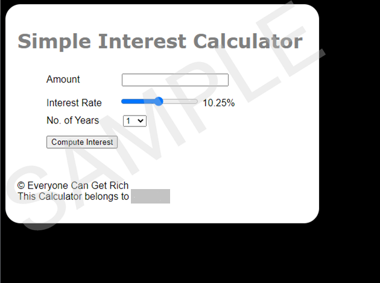
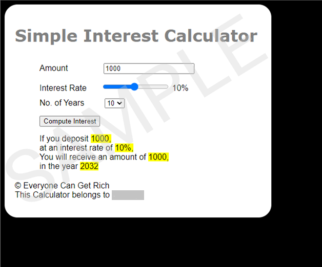

# Everyone Can Get Rich is a non-governmental charity organization. This NGO works to improve the financial literacy of the common people. They have hired a developer to create an online application. This app titled Simple Interest Calculator, will compute the interest one can earn given the amount you wish to save, the number of years you can keep it with the bank and the interest rate the bank would pay you

# The NGO is very particular about the way the app looks including the colors and the alignment of the form elements

>steps:

1. The NGO is very particular about the way the app looks including the colors and the alignment of the form elements. The NGO wants the app to look exactly like this. 

2. When a user enters 1000000 as amount, 3.5 as rate of interest and 5 as No. of years, and clicks the Compute button, an amount of 175000 must be displayed as interest. 

>Results:

1. The image of your fully designed calculator. 
2. The ‘Principal input box’ is present.
3. The ‘Interest Slider’ is present.
4. The ‘dropdown’ box expands to select the number of years.
5. The ‘compute interest’ button is present.
6. Check the answer to the values inserted: 1000 as Amount, 10% as Interest rate, and 10 as the number of years, the interest amount should be 1000 after compute interest is clicked.
7. Check the answer to the values inserted: 4800 as Amount, 15.25% as Interest rate, and 5 as the number of years, the interest amount should be 3660 after compute interest is clicked.
8. Alert box appears in the screenshot which asks the user to ‘Enter a positive number’ when the value of the principal is entered as zero.
9. Alert box appears in the screenshot which asks the user to ‘Enter a positive number’ when the value of the principal is entered as a negative number.
10. If the principal amount field is left blank, and while clicking on “Compute Interest”, there is an alert asking you to enter a positive number.
11. All the input controls are aligned at the center.
12. All the colors as specified in the requirements.
13. The borders of the div that contain the input elements are rounded.
14. After the Compute Interest is clicked, all the numbers in the output are highlighted in yellow.
15. Everything should be spelled correctly.
16. The title “Web App – Simple Interest Calculator” is visible on the browser page/tab.
17. When the interest rate slider is moved to extreme left, the interest rate should show as 1%.
18. When the interest rate slider is moved to extreme right, the interest rate should show as 20%.
19. The slider can be moved to show the value as 4.75%.
20. At the bottom of the calculator, there is a copyright symbol and the name of the owner.
